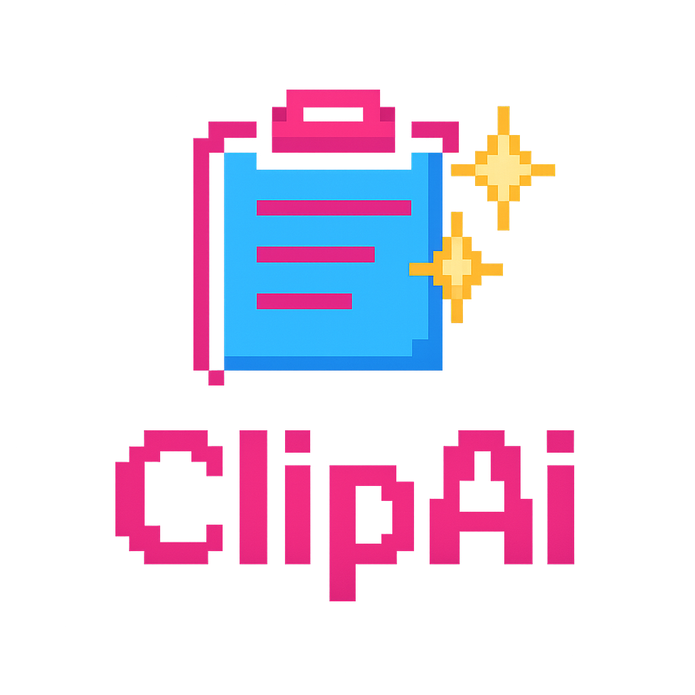
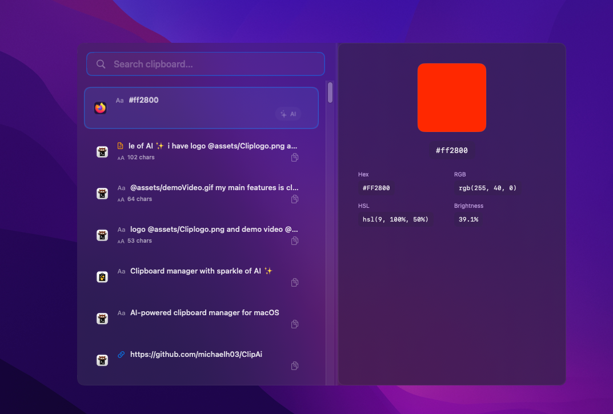

<p align="center">
 
</p>

<p align="center">
<em>Clipboard manager with a sparkle of AI ✨</em>
</p>

<p align="center">
Built as a side project with <a href="https://claude.ai/code">Claude Code</a>
</p>

<hr/>

<p align="center">
  <a href="https://github.com/michaelhsoft/ClipAI/blob/main/LICENSE"></a>
  <a href="#"></a>
</p>

**Your clipboard just got smarter.** 

ClipAI remembers everything you copy and lets you send it to AI with one click no more breaking your flow switching to ChatGPT and back. Review code, generate tickets, polish writing, all from your menu bar. Stay in your flow state.

<p align="center">
  
</p>

<p align="center">
<em>Search, preview, and AI-enhance your clipboard history</em>
</p>

<p align="center">
  
</p>

## Features

- **Smart Clipboard History** - Store and search through your clipboard history with an intuitive interface
- **Rich Content Preview** - Preview text, images, and code with syntax highlighting
- **One-Click AI Processing** - Transform clipboard content instantly with AI-powered prompts
- **Multiple AI Providers** - Choose between OpenAI or Google Gemini
- **Custom Prompts** - Create and manage your own AI prompts for specific workflows
- **Built-in Prompt Templates** - Code review, JIRA ticket generation, and text rewriting
- **Global Hotkeys** - Quick access to clipboard history and AI actions
- **Syntax Highlighting** - Automatic code detection and beautiful syntax highlighting

## Documentation

- [Installation](#installation)
- [Quick Start](#quick-start)
- [Features](#features)
- [Configuration](#configuration)

## Installation

### Homebrew (Recommended)

```bash
brew install --cask michaelh03/clipai/clipai
```

### Manual Download

Download the latest release from the [releases page](https://github.com/michaelhsoft/ClipAI/releases).

### Build from Source

```bash
git clone https://github.com/michaelhsoft/ClipAI.git
cd ClipAI
xcodebuild -scheme ClipAI -configuration Release
```

## Quick Start

1. Launch ClipAI - it will appear in your menu bar
2. Copy some text or code to your clipboard
3. Click the ClipAI menu bar icon or use the global hotkey to view your clipboard history
4. (Optional) Configure AI features:
   - Open Settings
   - Choose your AI provider (OpenAI or Google Gemini)
   - Enter your API key
   - Try one-click AI processing with built-in prompts or create your own

## Configuration

### AI Providers

ClipAI supports multiple AI providers. You'll need to provide your own API key:

**OpenAI:**
- Get your API key from [platform.openai.com](https://platform.openai.com)
- Enter it in Settings → OpenAI

**Google Gemini:**
- Get your API key from [ai.google.dev](https://ai.google.dev)
- Enter it in Settings → Gemini

### Custom Prompts

Create your own AI prompts for specific workflows:
1. Open Settings → Prompts
2. Add a new prompt with a name and template
3. Use `{input}` in your template to reference clipboard content
4. Assign a global hotkey for quick access

### Examples

Built-in prompt examples:
- **Code Review**: Analyze code for bugs, improvements, and best practices
- **JIRA Ticket**: Generate formatted JIRA tickets from requirements
- **Rewrite**: Improve grammar, clarity, and tone

## License

ClipAI is released under the MIT License. See [LICENSE](LICENSE) for details.

---

<p align="center">
Made with ❤️ for productivity enthusiasts
</p>
