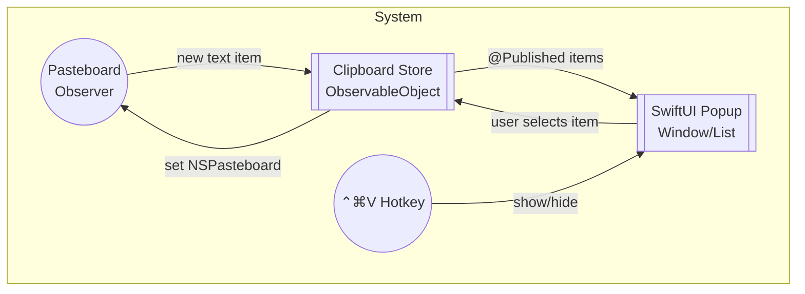

# Clipboard Manager ("ClipAI") – Product Requirements & Technical Plan

## 1. Overview
ClipAI is a lightweight macOS menu-bar utility that records the user’s text clipboard history and presents it in a fast popup window invoked via the global keyboard shortcut **⌃ ⌘ V** (Control + Command + V). The popup displays up to the 100 most-recent text snippets, allowing users to quickly re-copy any previous item with a single click or key press.

## 2. Goals
1. Capture every change to the system clipboard **only when the content is plain text**.
2. Maintain a **rolling history capped at 100 items** (newest first).
3. Surface history in a **SwiftUI-based popup** that appears centred beneath the current mouse cursor when the user presses **⌃ ⌘ V** from anywhere in macOS.
4. Provide a snappy UX: popup in <100 ms, instantaneous copy on selection.
5. Keep the app small (<5 MB compressed) and energy-efficient.

## 3. Non-Goals
• Rich-media (images, files, RTF) clipboard capture. 
• Cloud sync or multi-device support (future idea). 
• In-depth snippet editing/annotation.

## 4. Technology & Code-Stack Snapshot (current repo)
| Layer | Current Usage | Planned |
|-------|--------------|---------|
| UI | SwiftUI (default Xcode template) | Continue with SwiftUI; add `List`, `ScrollView`, custom row view |
| Application lifecycle | `@main` `App` struct | Expand to include menu-bar `NSStatusItem` & additional `Window` scenes |
| Clipboard access | _None yet_ | `NSPasteboard` polling / change-count observer |
| Global hotkey | _None yet_ | `HotKey` open-source library OR Carbon `RegisterEventHotKey` wrapper |
| Persistence | _None yet_ | Lightweight JSON file in `ApplicationSupport/com.company.ClipAI/clipboard.json` |
| Tests | Default `XCTestCase` stubs | Unit tests for `ClipboardStore` rollover logic |

> Search Results: The existing codebase contains only the default SwiftUI template (`ContentView`, `ClipAIApp`) and unit/UI test skeletons. No conflicting clipboard or hot-key code exists, so we will implement fresh modules.

## 5. Architecture

### 5.1 Key Components
**Architectural Style (MVVM & Swift Concurrency)**  
• We adopt the MVVM pattern: SwiftUI `View`s are stateless and observe `@Published` properties in their associated `ViewModel`s.  
• Business and side-effect logic (clipboard monitoring, persistence, hot-key handling) live in model/service layers or async view-models, clearly separated from UI code.  
• All asynchronous work must use Swift Concurrency (`async`/`await`, `Task`, `@MainActor`) rather than GCD callbacks, ensuring readable, testable, and cancellable workflows.
1. **ClipboardStore** (`ObservableObject`)
   • Holds `@Published var items: [ClipItem]` (max 100). 
   • Inserts new text at index 0; drops overflow. 
   • Persists to disk on change & reloads on launch.
2. **ClipItem** (Model)
   • `id: UUID`, `content: String`, `timestamp: Date`.
3. **PasteboardMonitor**
   • Polls `NSPasteboard.general.changeCount` every 0.25 s (run-loop timer) OR registers with new macOS 14 `NSPasteboard.didChangeNotification` when available.
4. **HotKeyListener**
   • Registers **⌃ ⌘ V** via `HotKey` (https://github.com/soffes/HotKey) or Carbon API fallback. 
   • Toggles `PopupController`.
5. **PopupController / Window**
   • Presents a borderless `NSWindow` hosting SwiftUI `PopupView`. 
   • Positions window near cursor; auto-closes on focus loss or `Esc`.
6. **PopupView**
   • `List` of `ClipItemRowView` (shows first 80 chars, monospaced, line-clamped). 
   • Keyboard navigation ↑/↓ and ⏎ to copy. 
   • Clicking row copies & closes popup.

## 6. UX Details
| Interaction | Behaviour |
|-------------|-----------|
| ⌃ ⌘ V pressed | Popup appears; first item pre-selected |
| ↑ / ↓ | Navigate items (wrap on ends) |
| ⏎ / Double-click | Copies selected item to clipboard & hides popup |
| Esc / click outside | Dismisses popup without copying |

Loading state: If no history, show "No text copied yet" placeholder.

## 7. Persistence Strategy
1. File location: `~/Library/Application Support/ClipAI/clipboard_history.json`.
2. On each insertion/removal, debounce-save (250 ms) to avoid disk churn.
3. Load on app launch; ignore corrupt file with fallback to empty list.

## 8. Error Handling & Privacy
• App reads clipboard **only** when Pasteboard change is detected; never sends data off-device. 
• No network permissions required. 
• Respect macOS privacy by adding `com.apple.security.personal-information.location` _not required_; only standard clipboard access.

## 9. Milestones & Tasks
| Sprint | Deliverables |
|--------|--------------|
| 0 (Setup) | Integrate `HotKey` via Swift Package; create modules boilerplate |
| 1 | Implement `ClipboardStore` with unit tests & persistence |
| 2 | Build `PasteboardMonitor`; integrate with store |
| 3 | Build popup window + basic list UI |
| 4 | Keyboard navigation & selection logic |
| 5 | Polish (animations, theming), code signing & notarisation |

## 10. Open Questions / TBD
1. Use `HotKey` vs custom Carbon wrapper? Evaluate App Store policy & binary size.
2. Do we autosave window position or always near cursor?
3. Should duplicate consecutive items be collapsed?
4. Minimum macOS version? (Tentatively macOS 13 Ventura).

## 11. Future Ideas (post-v1)
• Image/RTF support with preview thumbnails. 
• iCloud sync across devices. 
• Search field within popup. 
• AI summarisation of long copied text.

---
*Last updated: 2025-07-29* 