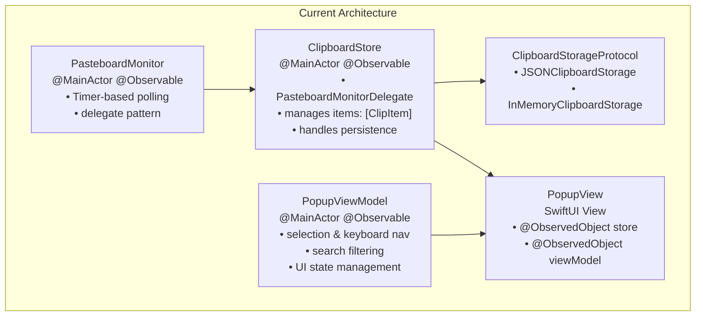
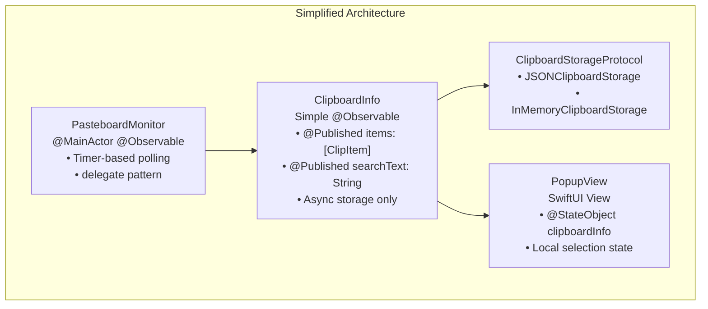

# ClipAI Refactoring Plan: Single Source of Truth with ClipboardInfo

## 1. Overview

This document outlines the refactoring plan to consolidate clipboard management into a single source of truth called `ClipboardInfo`, removing the current dual-layer architecture of `ClipboardStore` + `PopupViewModel` and replacing it with a streamlined approach where `ClipboardInfo` becomes a `@State` object in `PopupView.swift`.

## 2. Current Architecture Analysis

### 2.1 Code Stack & Patterns
- **Framework**: SwiftUI with Model
- **Concurrency**: Swift Concurrency (async/await, Task, @MainActor)
- **State Management**:  Using @Observable Macro
- **Storage**: Protocol-based abstraction (JSONClipboardStorage, InMemoryClipboardStorage)
- **System Integration**: AppKit (NSWindow, NSPasteboard, Timer-based polling)
- **Dependency Injection**: Constructor injection pattern

### 2.2 Current Components


### 2.3 Current Issues
1. **Dual State Management**: Both `ClipboardStore` and `PopupViewModel` are @Observables with overlapping responsibilities
2. **Complex Data Flow**: Items flow through multiple layers (Store → ViewModel → View)
3. **Tight Coupling**: `PopupViewModel` depends on `ClipboardStore` and duplicates filtering logic
4. **Over-Engineering**: Two @Observables for what could be a single source of truth

## 3. Refactored Architecture (Simplified)

### 3.1 New Architecture Overview


### 3.2 Key Design Decisions

#### 3.2.1 Minimal @Observable
- **Simple Class**: Only essential `@Published` properties
- **Two Core Properties**:
  1. `@Published var items: [ClipItem] = []` - The clipboard history
  2. `@Published var searchText: String = ""` - Search filter text
- **Async Storage**: Background persistence without blocking UI

#### 3.2.2 Local State in View
- **Selection State**: Keep `selectedItemId` as local `@State` in PopupView
- **Filtered Items**: Computed property derived from items + searchText
- **UI State**: Focus, animations, etc. remain as local `@State`

#### 3.2.3 State Ownership Pattern
- Use `@StateObject` for ClipboardInfo (view owns the object lifecycle)
- Keep complex UI interactions as local view state
- **Pattern**: Follows [SwiftUI @State best practices](https://developer.apple.com/documentation/swiftui/state)

## 4. Implementation Plan

### 4.1 Phase 1: Create ClipboardInfo Class

#### 4.1.1 File: `ClipAI/Model/ClipboardInfo.swift`
```swift
import Foundation
import AppKit

/// Simplified clipboard manager with just essential @Published properties
@MainActor
class ClipboardInfo: @Observable, PasteboardMonitorDelegate {
    // MARK: - Published Properties (Only 2!)
    /// All clipboard items, ordered by most recent first
    @Published var items: [ClipItem] = []
    
    /// Search text for filtering items  
    @Published var searchText: String = ""
    
    // MARK: - Private Dependencies
    private let storage: ClipboardStorageProtocol
    private let pasteboardMonitor: PasteboardMonitor
    private let maxItems = 100
    private var isLoading = false
    
    // MARK: - Initialization
    init(storage: ClipboardStorageProtocol? = nil, monitor: PasteboardMonitor? = nil) {
        // Setup storage (reuse existing pattern)
        if let storage = storage {
            self.storage = storage
        } else {
            do {
                self.storage = try JSONClipboardStorage()
            } catch {
                self.storage = InMemoryClipboardStorage()
            }
        }
        
        // Setup pasteboard monitor
        self.pasteboardMonitor = monitor ?? PasteboardMonitor()
        self.pasteboardMonitor.delegate = self
        
        // Load items asynchronously
        Task { await loadItems() }
    }
    
    // MARK: - Core Operations
    func addItem(content: String) {
        guard !content.trimmingCharacters(in: .whitespacesAndNewlines).isEmpty else { return }
        guard items.first?.content != content else { return }
        
        items.removeAll { $0.content == content }
        items.insert(ClipItem(content: content), at: 0)
        
        if items.count > maxItems {
            items = Array(items.prefix(maxItems))
        }
        
        Task { await saveItems() }
    }
    
    func removeItem(_ item: ClipItem) {
        items.removeAll { $0.id == item.id }
        Task { await saveItems() }
    }
    
    func clearAll() {
        items.removeAll()
        Task { await saveItems() }
    }
    
    func startMonitoring() { pasteboardMonitor.startMonitoring() }
    func stopMonitoring() { pasteboardMonitor.stopMonitoring() }
    
    // MARK: - PasteboardMonitorDelegate
    func pasteboardMonitor(_ monitor: PasteboardMonitor, didDetectNewContent content: String) {
        addItem(content: content)
    }
    
    // MARK: - Private Async Storage
    private func loadItems() async {
        isLoading = true
        defer { isLoading = false }
        
        do {
            let loadedItems = try await storage.loadItems()
            await MainActor.run {
                items = Array(loadedItems.prefix(maxItems))
            }
        } catch {
            print("Error loading clipboard items: \(error)")
        }
    }
    
    private func saveItems() async {
        guard !isLoading else { return }
        
        do {
            try await storage.saveItems(items)
        } catch {
            print("Error saving clipboard items: \(error)")
        }
    }
}
```

#### 4.1.2 Reused Components
- **Storage Layer**: Keep existing `ClipboardStorageProtocol`, `JSONClipboardStorage`, `InMemoryClipboardStorage`
- **PasteboardMonitor**: Keep existing implementation, just change delegate
- **ClipItem**: Keep existing model unchanged

### 4.2 Phase 2: Update PopupView

#### 4.2.1 File: `ClipAI/Views/PopupView.swift`
```swift
struct PopupView: View {
    // MARK: - State Management
    @StateObject private var clipboardInfo = ClipboardInfo()
    
    // MARK: - Local UI State (kept in view)
    @State private var selectedItemId: UUID?
    @FocusState private var isListFocused: Bool
    @State private var showContent = false
    @State private var searchFieldFocus: Bool = true
    
    // MARK: - Computed Properties
    /// Items filtered by search text (derived from clipboardInfo)
    private var filteredItems: [ClipItem] {
        let query = clipboardInfo.searchText.trimmingCharacters(in: .whitespacesAndNewlines)
        if query.isEmpty {
            return clipboardInfo.items
        } else {
            return clipboardInfo.items.filter { 
                $0.content.localizedCaseInsensitiveContains(query) 
            }
        }
    }

    var body: some View {
        VStack(spacing: 0) {
            // Header shows count from clipboardInfo
            HeaderView(itemCount: clipboardInfo.items.count)
            
            // Search binds directly to clipboardInfo.searchText
            SearchBarView(text: $clipboardInfo.searchText, focus: $searchFieldFocus)
                .padding(.horizontal, 16)
                .padding(.vertical, 8)

            // Content uses computed filteredItems and local selectedItemId
            ZStack {
                if clipboardInfo.items.isEmpty {
                    EmptyStateView()
                } else {
                    ClipboardListView(
                        items: filteredItems,
                        selectedItemId: $selectedItemId,
                        onItemTapped: { item in
                            selectedItemId = item.id
                            copyItemToClipboard(item)
                        },
                        onItemHovered: { item in
                            selectedItemId = item.id
                        }
                    )
                }
            }
        }
        .frame(width: 400, height: 500)
        // ... rest of styling
        .onAppear {
            clipboardInfo.startMonitoring()
            selectFirstItemIfNeeded()
        }
        .onChange(of: filteredItems) { _, _ in
            validateSelection()
        }
    }
    
    // MARK: - Local Helper Methods
    private func selectFirstItemIfNeeded() {
        if selectedItemId == nil, let firstItem = filteredItems.first {
            selectedItemId = firstItem.id
        }
    }
    
    private func validateSelection() {
        if let selectedId = selectedItemId,
           !filteredItems.contains(where: { $0.id == selectedId }) {
            selectedItemId = filteredItems.first?.id
        }
    }
    
    private func copyItemToClipboard(_ item: ClipItem) {
        let pasteboard = NSPasteboard.general
        pasteboard.clearContents()
        pasteboard.setString(item.content, forType: .string)
    }
}
```

### 4.3 Phase 3: Update Child Views

#### 4.3.1 Update ClipboardListView
- Remove `viewModel` parameter, use `clipboardInfo` directly
- Bind to `clipboardInfo.filteredItems` and `clipboardInfo.selectedItemId`

#### 4.3.2 Update HeaderView
- Receive item count as parameter instead of entire store
- Simplify to pure view without business logic

### 4.4 Phase 4: Update Controllers & App Entry Points

#### 4.4.1 Update PopupController
```swift
class PopupController: NSWindowController {
    private var clipboardInfo: ClipboardInfo?
    
    private func setupContent() {
        let popupView = PopupView()
        // PopupView now manages its own ClipboardInfo via @State
    }
}
```

#### 4.4.2 Update AppDelegate
```swift
class AppDelegate: NSObject, NSApplicationDelegate {
    // Remove clipboardStore property
    // PopupController will create its own PopupView with @State ClipboardInfo
}
```

### 4.5 Phase 5: Clean Up

#### 4.5.1 Files to Remove
- `ClipAI/Model/ClipboardStore.swift`
- `ClipAI/ViewModels/PopupViewModel.swift`

#### 4.5.2 Files to Update
- `ClipAI/Views/ClipboardListView.swift`
- `ClipAI/Views/HeaderView.swift`
- `ClipAI/Controllers/PopupController.swift`
- `ClipAI/ClipAIApp.swift`
- `ClipAI/ContentView.swift`

## 5. Detailed Implementation

### 5.1 ClipboardInfo Core Methods

#### 5.1.1 Async Storage Management
```swift
/// Load items from storage asynchronously
private func loadItems() async {
    isLoading = true
    defer { isLoading = false }
    
    do {
        let loadedItems = try await storage.loadItems()
        items = Array(loadedItems.prefix(maxItems))
        updateFilteredItems()
    } catch {
        print("Error loading clipboard items: \(error)")
    }
}

/// Save items to storage asynchronously
private func saveItems() async {
    guard !isLoading else { return }
    
    do {
        try await storage.saveItems(items)
    } catch {
        print("Error saving clipboard items: \(error)")
    }
}
```

#### 5.1.2 Search & Filtering
```swift
/// Update filtered items based on current search text
private func updateFilteredItems() {
    let query = searchText.trimmingCharacters(in: .whitespacesAndNewlines)
    if query.isEmpty {
        filteredItems = items
    } else {
        filteredItems = items.filter { $0.content.localizedCaseInsensitiveContains(query) }
    }
    
    // Ensure selected item is still visible
    validateSelection()
}
```

#### 5.1.3 Selection Management
```swift
/// Ensure selected item is still valid in filtered results
private func validateSelection() {
    if let selectedId = selectedItemId,
       !filteredItems.contains(where: { $0.id == selectedId }) {
        selectedItemId = filteredItems.first?.id
    }
}

/// Select first item if none selected and items available
func selectFirstItemIfNeeded() {
    if selectedItemId == nil, let firstItem = filteredItems.first {
        selectedItemId = firstItem.id
    }
}
```

### 5.2 Migration Strategy

#### 5.2.1 Method Mapping
| ClipboardStore Method | ClipboardInfo Method | PopupViewModel Method | ClipboardInfo Method |
|----------------------|---------------------|----------------------|---------------------|
| `addItem(content:)` | `addItem(content:)` | `selectItem(with:)` | `selectItem(with:)` |
| `removeItem(_:)` | `removeItem(_:)` | `selectNextItem()` | `selectNextItem()` |
| `clearAll()` | `clearAll()` | `selectPreviousItem()` | `selectPreviousItem()` |
| `startMonitoring()` | `startMonitoring()` | `updateFilteredItems()` | `updateFilteredItems()` |
| `stopMonitoring()` | `stopMonitoring()` | `handleKeyboardEvent(_:)` | `handleKeyboardEvent(_:)` |

#### 5.2.2 Property Mapping
| Current Property | New Property | Notes |
|------------------|--------------|-------|
| `ClipboardStore.items` | `ClipboardInfo.items` | `@Published` - Direct mapping |
| `PopupViewModel.searchText` | `ClipboardInfo.searchText` | `@Published` - Direct mapping |
| `PopupViewModel.selectedItemId` | `PopupView.selectedItemId` | `@State` - Local UI state in view |
| `PopupViewModel.filteredItems` | `PopupView.filteredItems` | Computed property in view |

## 6. Benefits of Simplified Architecture

### 6.1 Drastically Simplified State Management
- **Just 2 @Published Properties**: Only essential state in ClipboardInfo
- **No Complex Coordination**: Direct binding between ClipboardInfo and PopupView
- **Clear Ownership**: PopupView owns ClipboardInfo via `@StateObject`

### 6.2 Minimal Overhead
- **Single @Observable**: Only one source of @Published changes
- **Local UI State**: Selection, focus, animations stay in the view where they belong
- **Computed Properties**: Filtering derived on-demand from the 2 published properties

### 6.3 Much Simpler Codebase
- **Fewer Files**: Removes ~400 lines (ClipboardStore.swift + PopupViewModel.swift)
- **Single Responsibility**: ClipboardInfo only manages data + persistence
- **Easy to Understand**: Clear separation between data (ClipboardInfo) and UI (PopupView)

### 6.4 Follows SwiftUI Best Practices
- **@StateObject Pattern**: View owns the lifecycle as recommended in [SwiftUI @State docs](https://developer.apple.com/documentation/swiftui/state)
- **Local State**: Complex UI interactions stay local to the view
- **Minimal Published State**: Only publish what actually needs to trigger UI updates

## 7. Testing Considerations

### 7.1 Unit Tests to Update
- `ClipAITests/ClipboardStoreTests.swift` → `ClipAITests/ClipboardInfoTests.swift`
- Update test cases to use ClipboardInfo instead of ClipboardStore
- Add tests for integrated search and selection functionality

### 7.2 New Test Cases
- Async storage operations
- Search filtering with selection validation
- Keyboard navigation with search active
- State consistency during concurrent operations

## 8. Risk Mitigation

### 8.1 Compatibility
- **macOS Version**: @Observable requires macOS 14+, verify target deployment
- **SwiftUI Version**: Ensure SwiftUI features are compatible with minimum OS version

### 8.2 Migration Strategy
- **Feature Parity**: Ensure all existing functionality is preserved
- **Performance Testing**: Verify no performance regressions
- **User Testing**: Test keyboard navigation and search functionality thoroughly

## 9. Implementation Timeline (Simplified)

### 9.1 Phase Timeline
1. **Phase 1** (ClipboardInfo creation): 1 hour
2. **Phase 2** (PopupView update): 30 minutes  
3. **Phase 3** (Child views update): 30 minutes
4. **Phase 4** (Controllers update): 15 minutes
5. **Phase 5** (Cleanup & testing): 30 minutes

**Total Estimated Time**: 2.5-3 hours (much faster with simplified approach!)

### 9.2 Validation Checkpoints
- [ ] ClipboardInfo class compiles and basic functionality works
- [ ] PopupView displays correctly with @State ClipboardInfo
- [ ] Search filtering works correctly
- [ ] Keyboard navigation functions properly
- [ ] Persistence works asynchronously
- [ ] All existing features preserved
- [ ] Performance is equal or better
- [ ] Tests pass

## 10. Conclusion

This simplified refactoring dramatically reduces the ClipAI architecture complexity by:

- **Eliminating Dual State Management**: Replace ClipboardStore + PopupViewModel with a single ClipboardInfo class  
- **Just 2 @Published Properties**: Only `items` and `searchText` - everything else is local UI state
- **Following [SwiftUI @State Best Practices](https://developer.apple.com/documentation/swiftui/state)**: View owns the ClipboardInfo lifecycle via `@StateObject`
- **Massive Code Reduction**: ~400 lines removed, 2 entire files eliminated

The result is a much cleaner, easier-to-understand architecture that preserves all functionality while being significantly simpler to maintain and extend. The estimated implementation time is only 2.5-3 hours thanks to this streamlined approach.