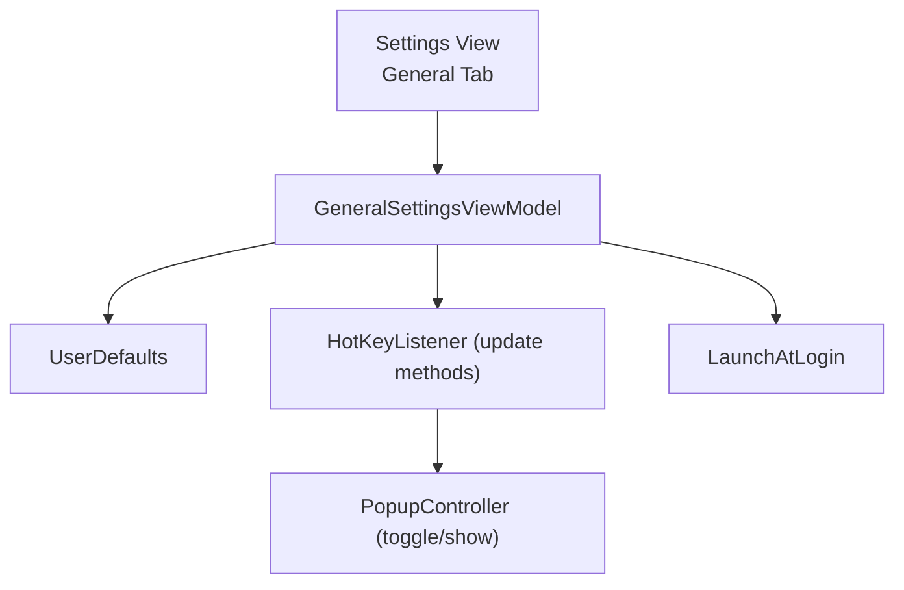

## General Settings — PRD and Technical Plan

### 1. Overview
Add a General settings section that lets users:
- Set a custom global shortcut for: (1) Show App and (2) One‑Click AI
- Enable/disable Start at Login

This extends the existing settings window (currently focused on LLM configuration) to include a new "General" tab. The hotkeys should apply immediately after change and persist across launches.

### 2. Goals
- Provide a clear, reliable, and conflict‑aware way to customize two global shortcuts:
  - Show App (toggle popup)
  - One‑Click AI (process clipboard with default provider/prompt)
- Persist preferences and re‑register hotkeys on launch.
- Support Start at Login toggle.
- Keep a small dependency surface and integrate with existing architecture.

### 3. Non‑Goals
- Shortcut profiles, per‑app overrides, or per‑workspace customization.
- Import/export of settings.
- Arbitrary command binding beyond the two defined actions.

### 4. Current Stack Snapshot (from repo)
- UI: SwiftUI with an AppKit `NSStatusItem` menu.
- Windowing: `PopupController` controls a popup window with `PopupView`.
- Global hotkeys: `HotKey` (Soffes) in `HotKeyListener.swift` with hardcoded defaults.
  - Show App: currently `⌃⌘V` (Control+Command+V).
  - One‑Click AI: code uses `⌃⌘⌥⇧Q` (Control+Command+Option+Shift+Q); comments mention `⌃⌘⌥V`. We will resolve this discrepancy.
- Settings UI: `LLMSettingsWindowController.swift` shows `LLMSettingsView.swift` which hosts a `CustomTabView` with "AI Models" and "Prompts".

### 5. User Stories
- As a user, I can open Settings → General and record a custom key combination for Show App.
- As a user, I can set a custom key combination for One‑Click AI.
- As a user, I get immediate feedback if a shortcut is invalid or conflicts with the other app shortcut.
- As a user, when I change a shortcut, it starts working right away globally.
- As a user, I can toggle Start at Login.
- As a user, my preferences persist across restarts and upgrades.

### 6. UX and UI
- Add a new tab "General" to the existing `LLMSettingsView` `CustomTabView`.
- Layout:
  - Section: Shortcuts
    - Show App: [Shortcut Recorder]  "Reset to default" button
    - One‑Click AI: [Shortcut Recorder]  "Reset to default" button
    - Helper text: "Must include ⌘ and at least one additional modifier."
    - Validation messaging for conflicts or disallowed combos.
  - Divider
  - Section: Startup
    - Checkbox: "Start ClipAI at login"
  - Footer: "Changes apply immediately."

Shortcut recorder behavior:
- Capture the next key down while the field is focused.
- Display a formatted string (e.g., "⌃⌘V").
- Enforce rules (see 7.2) and show inline error states.

### 7. Functional Requirements
7.1 Defaults and Migration
- Defaults:
  - Show App: `⌃⌘V`.
  - One‑Click AI: `⌃⌘⌥V` (align UI, comments, and code; see 11.1).
- On first launch of this feature, if no stored shortcuts exist, apply defaults.
- If stored values are malformed, fall back to defaults.

7.2 Validation Rules
- Must include ⌘ (Command) + at least one of ⌃ (Control), ⌥ (Option), or ⇧ (Shift).
- Disallow bare function keys or single‑modifier combos.
- Disallow duplicates between the two actions.
- Warn (non‑blocking) if the chosen combo is commonly used by macOS system shortcuts.

7.3 Persistence
- Store in `UserDefaults` under keys:
  - `general.showShortcut`
  - `general.oneClickShortcut`
- Shortcut format: JSON string or dictionary with fields `{ keyCode: Int, modifiers: Int, display: String }`.
  - `modifiers` as a bitmask compatible with HotKey/Carbon masks.
- Start at Login source‑of‑truth is `LaunchAtLogin.isEnabled` (not persisted in `UserDefaults`). The UI reads and writes directly to this property.

7.4 Runtime Application
- On change, de‑register old hotkey and register the new one immediately.
- On app launch, read preferences and register hotkeys.
- Provide a safe fallback to defaults if registration fails.

7.5 Start at Login
- We will use `LaunchAtLogin` (SPM, by Sindre Sorhus) as the single implementation.
- API usage: `LaunchAtLogin.isEnabled` for both reading and toggling the state.
- No duplicate persistence. The package manages the system state; our UI binds to it.

### 8. Architecture and Integration


Components to extend or add:
- `LLMSettingsView.swift`: Add a new tab entry `(title: "General", icon: "gearshape")` that hosts `GeneralSettingsView`.
- `GeneralSettingsView.swift` (new): SwiftUI UI for recorder controls and login toggle.
- `GeneralSettingsViewModel.swift` (new):
  - Loads/saves `UserDefaults` values.
  - Validates and formats shortcuts.
  - Calls into `HotKeyListener` to re‑register.
- `HotKeyListener.swift` (edit):
  - Refactor to support dynamic registration:
    - `func update(showShortcut: ShortcutSpec, oneClickShortcut: ShortcutSpec)`.
    - Internally convert to `HotKey` instances, dealloc old, assign new handlers.
  - Provide static defaults.
- `Settings` storage helpers (new small utility): encode/decode `ShortcutSpec` to/from `UserDefaults`.
- Start at login integration: add `LaunchAtLogin` dependency and wire to `GeneralSettingsViewModel`.

### 9. Data Model
```swift
struct ShortcutSpec: Codable, Equatable {
    let keyCode: Int
    let modifiers: Int // bitmask (command, option, control, shift)
    let display: String // e.g., "⌃⌘V"
}
```

UserDefaults keys:
- `general.showShortcut: Data<String>` (encoded `ShortcutSpec` or JSON string)
- `general.oneClickShortcut: Data<String>`
- `general.launchAtLogin: Bool`

### 10. Implementation Details
10.1 Shortcut Recorder UI
- Implement a SwiftUI recorder field:
  - Use a custom `NSViewRepresentable` to intercept key events and produce a `ShortcutSpec`.
  - Render the `display` string and keep the recorder focused until a valid combo is captured.
  - Provide a clear button and a reset‑to‑default button.
- Alternative: adopt `KeyboardShortcuts` SPM, which includes a recorder view, but would overlap with `HotKey`. We will stay with `HotKey` and a light custom recorder to avoid mixing libraries.

10.2 HotKey Registration
- Translate `ShortcutSpec` into `HotKey.Key` + `KeyCombo` / Carbon constants.
- Always deregister previous `HotKey` instances before registering new ones.
- Threading: ensure registration and UI callbacks occur on main.

10.3 Start at Login
- Add SPM dependency: [`LaunchAtLogin`](https://github.com/sindresorhus/LaunchAtLogin).
- Follow the package’s README to complete setup in Xcode (add the package, integrate any required helper as instructed by the package/version).
- Bind the UI toggle directly to `LaunchAtLogin.isEnabled`.

### 11. Edge Cases & Decisions
11.1 Default mismatch resolution
- Align the One‑Click AI default to `⌃⌘⌥V` (common pattern and matches prior comments). Update code and documentation accordingly.

11.2 Conflicts
- If a user assigns the same combo to both actions, block save and display an inline error.

11.3 System‑reserved shortcuts
- We will not hard‑block, but we will warn if user chooses combos commonly used by macOS (e.g., `⌘Space`). Provide a tooltip note.

11.4 Invalid capture
- If only a printable key without required modifiers is captured, keep the recorder active and show an inline error.

### 12. Accessibility, Privacy, and Permissions
- `HotKey` uses Carbon hotkey registration and does not require Accessibility privileges.
- Start at Login is handled by the `LaunchAtLogin` package; no additional entitlements are required beyond what the package configures.

### 13. Testing
- Unit tests:
  - Shortcut parsing/formatting and modifier bitmask mapping.
  - UserDefaults round‑trip for `ShortcutSpec`.
- Integration tests (manual / QA checklist):
  - Change each shortcut; confirm it works globally and persists after relaunch.
  - Conflict detection behavior.
  - Start at Login toggle persists; app launches on next login or simulated environment.

### 14. Rollout & Migration
- Introduce new defaults. On first run of the new version, if keys are missing, write defaults.
- If existing code used the earlier `⌃⌘⌥⇧Q`, the new default will take precedence only if user has not customized; otherwise respect user choice.

### 15. Tasks & Estimates
- Add General tab UI and view model: 1.0–1.5 days
- Implement recorder control (SwiftUI + AppKit bridge): 0.5–1.0 day
- Refactor `HotKeyListener` for dynamic registration: 0.5 day
- Persistence helpers (UserDefaults + Codable): 0.25 day
- Start at Login integration (`LaunchAtLogin` package + wiring): 0.5 day
- QA and polish (copy, validation, defaults): 0.5 day
- Total: ~3–4 days

### 16. Acceptance Criteria
- Users can set working custom shortcuts for Show App and One‑Click AI.
- Shortcuts validate and apply immediately; conflicts are prevented.
- Preferences persist across restarts.
- Start at Login toggle works and persists.
- Documentation and UI copy reflect the final defaults (`⌃⌘V` and `⌃⌘⌥V`).

