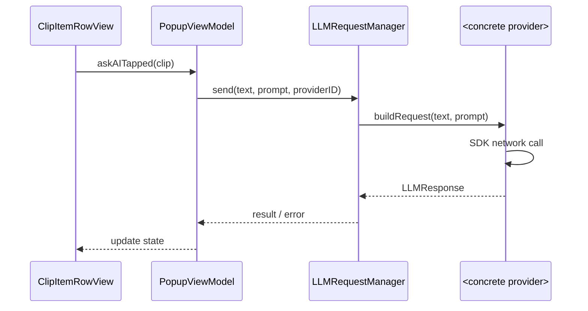

# "Ask AI" Feature – Product Requirements & Technical Plan

## 1. Overview
ClipAI already captures the user’s clipboard history and presents it in a popup window.  
The **"Ask AI"** feature lets the user send the content of any `ClipItem` to a Large-Language-Model (LLM) and receive an answer (e.g. *summarise this*, *translate to French*, *explain this code*).  
The solution must:

1. Work with multiple providers (initially OpenAI, Google Gemini, Anthropic Claude) via their respective SDKs.
2. Expose a *generic* Swift API so more providers can be added without touching UI/business-logic.
3. Support pluggable **System Prompts** (templates) to steer each request.
4. Keep sensitive API keys in the user's Keychain / encrypted defaults.
5. Present returned text inside the existing UI (inline preview pane) without blocking the main thread.

### Why MacPaw/OpenAI?
- **Unified SDK**: Single library supports OpenAI + 6+ other providers (Gemini, Claude, DeepSeek, etc.)
- **Swift-native**: Built for Swift/iOS/macOS with proper async/await support
- **Mature & Maintained**: 8.8/10 trust score, active community, 68+ code examples
- **Feature-complete**: Chat, Images, Audio, Assistants, Function Calling, Structured Outputs
- **Flexible Configuration**: Custom parsing, timeouts, multiple provider endpoints
- **Future-proof**: MCP (Model Context Protocol) support for advanced tool integration

---

## 2. Goals
| ID | Description | Success Metric |
|----|-------------|----------------|
| G1 | One-click **Ask AI** button on each `ClipItemRowView` | <= 150 ms button latency to open request sheet |
| G2 | Provider-agnostic abstraction (`LLMProvider` protocol) | New provider can be added in < 50 LOC |
| G3 | Configurable System Prompts | User can switch prompt from a dropdown before sending |
| G4 | Non-blocking UI | No dropped frames during network call (main thread stays idle) |
| G5 | Error feedback | Toast + retry when request fails |

### Out-of-Scope (Non-Goals)
• Streaming/partial responses (future).  
• Image/JSON function-calling outputs.  
• Long-term chat history persistence.

---

## 3. Technology & Code-Stack Snapshot
| Layer | Current Usage (scan 2025-08-02) | Impact / Additions |
|-------|---------------------------------|--------------------|
| UI | SwiftUI (macOS 14) | Add `Button { … }` & a modal sheet for prompt selection & result |
| Async | Swift Concurrency (`async/await`, `Task`) | Continue – LLM requests run on background `URLSession` |
| Dependency Mgmt | Swift Package Manager | Add **MacPaw/OpenAI** SDK (supports OpenAI, Gemini, Claude, others) + fallback provider-specific SDKs |
| Persistence | `UserDefaults`, JSON & SQLite for clips | Add secure key storage (`Keychain`) + `Codable` `SystemPrompt` list |
| Testing | `XCTest`, mocks for storage | Add `LLMProviderMock` for unit tests |

---

## 4. Architecture


### 4.1 Component Responsibility
* `LLMProvider` **protocol** – minimal surface:
  ```swift
  protocol LLMProvider {
      var id: String { get }
      var displayName: String { get }
      func send(text: String, prompt: SystemPrompt) async throws -> String
  }
  ```
* **Primary Implementation**: `MacPawOpenAIProvider` – uses MacPaw/OpenAI SDK with multi-provider support:
  ```swift
  struct MacPawOpenAIProvider: LLMProvider {
      private let client: OpenAIProtocol
      private let model: Model
      
      init(apiKey: String, model: Model, configuration: OpenAI.Configuration? = nil) {
          let config = configuration ?? OpenAI.Configuration(token: apiKey)
          self.client = OpenAI(configuration: config)
          self.model = model
      }
      
      func send(text: String, prompt: SystemPrompt) async throws -> String {
          let query = ChatQuery(
              messages: [
                  .system(.init(content: .string(prompt.template.replacingOccurrences(of: "{input}", with: text)))),
                  .user(.init(content: .string(text)))
              ],
              model: model
          )
          let result = try await client.chats(query: query)
          return result.choices.first?.message.content?.string ?? ""
      }
  }
  ```
* Fallback providers (`GeminiProvider`, `ClaudeProvider`) for advanced features not in MacPaw/OpenAI.
* `LLMRequestManager` – in-flight task tracker, throttling, retry/back-off.
* `SystemPrompt` – value type:
  ```swift
  struct SystemPrompt: Identifiable, Codable {
      let id: String           // UUIDv7
      let title: String        // "Summarise"
      let template: String     // "Summarise the following text in 3 bullet-points:\n{input}"
  }
  ```
* `PromptStore` – loads default prompts bundle-time + user-added prompts (`ApplicationSupport/ClipAI/prompts.json`).
* **UI** additions:
  1. `Ask AI` icon button (appears on row hover).  
  2. Modal sheet: provider picker, prompt picker, *Send* button.  
  3. Progress indicator while awaiting.  
  4. Result shown in existing right-hand preview pane (re-use `PreviewWindowView`).
* **Settings** window tab: API key entry per provider + default prompt selection.

---

## 5. Data Flow & Threading
* UI interaction always on `@MainActor`.
* `LLMRequestManager.send` marked `async` – executed in background `Task`.
* SDKs dispatch their own networking; completion awaited.
* Response marshalled back to main actor for state update (SwiftUI will re-render).
* Errors surfaced through `@Published var aiError: LLMError?` in `PopupViewModel`.

---

## 6. Persistence / Security
| Item | Storage | Notes |
|------|---------|-------|
| API Keys | macOS Keychain via `KeychainSwift` wrapper (SPM) | kSecAttrAccount = provider id |
| Prompt List | `~/Library/Application Support/ClipAI/prompts.json` | Array<SystemPrompt> |
| Last Provider | `UserDefaults` | For fast reuse |

---

## 7. UX Details
| Interaction | Behaviour |
|-------------|-----------|
| Hover row | `Ask AI` button fades in (opacity 0→1, 120 ms) |
| Click button | Opens modal anchored to row (uses SwiftUI `.sheet`) |
| Press ⏎ inside modal | Dispatches request & closes modal |
| While waiting | Inline spinning indicator in preview pane |
| On success | Response text appears, selectable/copyable |
| On error | Red banner with retry button |

Keyboard shortcuts: in modal, ↑/↓ cycles system prompts, ⌘⏎ sends.

---

## 8. Error Handling & Limits
* Map SDK-specific errors → unified `LLMError` enum (`quotaExceeded`, `invalidKey`, `network`, `unknown`).
* Per-provider rate-limit: track timestamps; show cooldown toast.
* Protect against >16 kB prompt by truncating middle with ellipsis (LLM token limit guard).

---

## 9. Migration & Backwards Compatibility
No existing files are modified on disk except UI. If user never sets API keys the button is hidden (feature-flag ‑> detects missing credentials).

---

## 10. Dependencies & Setup

### MacPaw/OpenAI Integration
**Package.swift** (or Xcode > Add Package Dependencies):
```swift
dependencies: [
    .package(url: "https://github.com/MacPaw/OpenAI.git", branch: "main")
]
```

**Supported Models & Providers** (via MacPaw/OpenAI):
- **OpenAI**: `gpt-4o`, `gpt-4-turbo`, `gpt-3.5-turbo`
- **Multi-provider support**: Gemini, Claude, DeepSeek, Perplexity, OpenRouter
- **Configuration options**: Custom parsing, timeout, organization ID

**Provider Configuration Examples**:
```swift
// OpenAI (default)
let openAIConfig = OpenAI.Configuration(token: apiKey)
let openAIProvider = MacPawOpenAIProvider(apiKey: apiKey, model: .gpt4_o)

// Alternative providers (same SDK)
let geminiConfig = OpenAI.Configuration(token: apiKey, host: "generativelanguage.googleapis.com")
let geminiProvider = MacPawOpenAIProvider(apiKey: apiKey, model: "gemini-pro", configuration: geminiConfig)
```

---

## 11. Milestones & Tasks
| Sprint | Deliverables |
|--------|--------------|
| 0 (prep) | **Integrate MacPaw/OpenAI SDK**, evaluate KeychainSwift for secret storage |
| 1 | Core abstraction (`LLMProvider`, manager, mock) + unit tests |
| 2 | `MacPawOpenAIProvider` implementation & settings UI for API keys |
| 3 | `Ask AI` button in row + modal sheet + result preview |
| 4 | Add multi-provider support (Gemini, Claude via MacPaw/OpenAI); provider picker |
| 5 | Prompt templates CRUD UI + persistence |
| 6 | Polish, localisation, analytics, documentation |

---

## 12. Open Questions
1. Should responses be cached in the model for offline view?  
2. Add streaming/markdown rendering (MacPaw/OpenAI supports streaming)?  
3. Rate-limit strategy for high-volume use?
4. Should we leverage MacPaw/OpenAI's **MCP (Model Context Protocol)** support for advanced tool integration?

---
*Last updated: 2025-01-16*