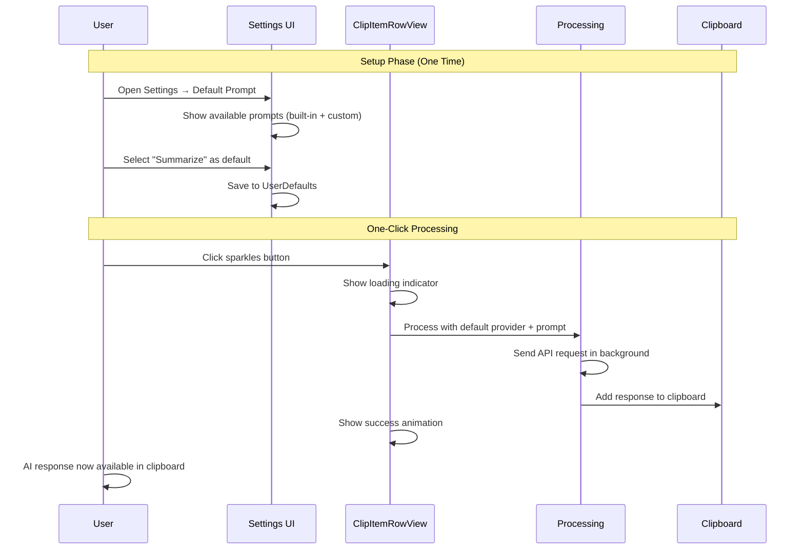
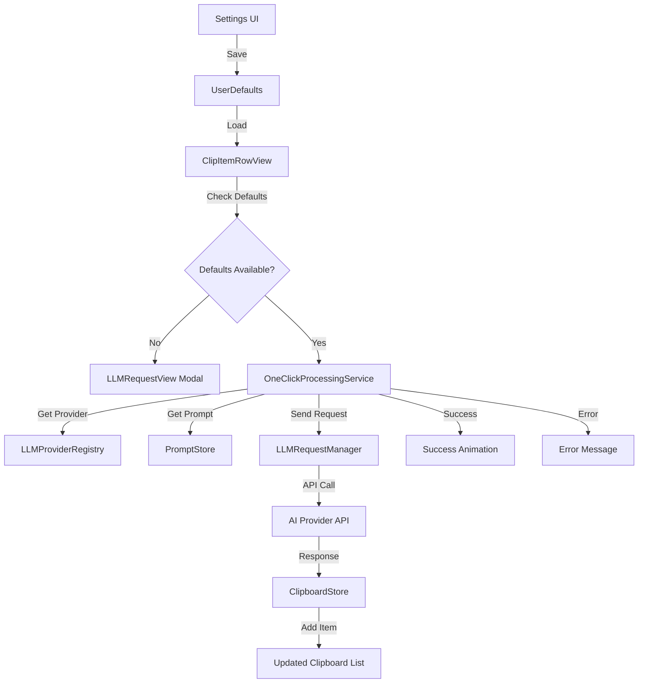

# One-Click AI Processing with Default System Prompts - PRD

## 1. Overview

This document outlines the implementation plan for enhancing ClipAI's "Ask AI" feature to support one-click processing using pre-configured default settings. Users will be able to select a default system prompt (from presets or custom prompts) and when they press the sparkles button, it will automatically send the clipboard content to their default AI provider using the selected prompt, then place the response directly back into the clipboard - all without showing any popups or modals.

### Current State Analysis
- ✅ **Default AI Provider**: Already implemented with automatic selection based on availability and priority
- ✅ **System Prompts Management**: Complete with built-in and custom prompts
- ✅ **AI Provider Infrastructure**: LLMProvider protocol, LLMRequestManager, multiple providers
- ✅ **Settings UI**: Existing settings window with AI configuration and prompts management
- ❌ **Default System Prompt Selection**: Missing - needs to be added
- ❌ **One-Click Processing**: Currently opens modal for each request
- ❌ **Direct Clipboard Integration**: Results currently shown in modal, not added to clipboard

## 2. Goals & Success Metrics

| ID | Goal | Success Metric |
|----|------|----------------|
| G1 | **Default System Prompt Selection** | User can select and save a default prompt from settings |
| G2 | **One-Click Processing** | Sparkles button processes clipboard content without popups in < 200ms |
| G3 | **Direct Clipboard Integration** | AI response automatically added as new clipboard item |
| G4 | **Visual Feedback** | Clear loading state and result indication without blocking UI |
| G5 | **Graceful Fallback** | If no defaults set, fallback to current modal behavior |

### Out of Scope
- Streaming responses (future enhancement)
- Multiple prompt chaining
- Response formatting options
- Batch processing multiple clips

## 3. Technology Stack Analysis

| Layer | Current Implementation | Changes Required |
|-------|----------------------|------------------|
| **UI** | SwiftUI, existing ClipItemRowView | Modify sparkles button behavior, add loading states |
| **Settings** | LLMSettingsView with AI config & prompts tabs | Add default prompt selection UI |
| **Storage** | UserDefaults for selectedModels, Keychain for API keys | Add UserDefaults for defaultSystemPromptId |
| **State Management** | @Observable pattern, LLMSettingsViewModel | Extend for default prompt management |
| **AI Processing** | LLMRequestManager, LLMProvider protocol | Reuse existing infrastructure |
| **Clipboard** | ClipboardStore with addItem() method | Use existing clipboard integration |

## 4. User Experience Flow



## 5. Architecture Design

### 5.1 Settings Enhancement

#### Default System Prompt Selection UI
Location: `PromptsEditorView.swift` - add new section above existing prompts list

```swift
// New section to add to PromptsEditorView
private var defaultPromptSelectionView: some View {
    VStack(alignment: .leading, spacing: 12) {
        Text("Default Prompt for One-Click Processing")
            .font(.headline)
        
        HStack {
            if let defaultPrompt = viewModel.getDefaultSystemPrompt() {
                Label(defaultPrompt.title, systemImage: "star.fill")
                    .foregroundColor(.orange)
            } else {
                Label("No default prompt selected", systemImage: "exclamationmark.triangle")
                    .foregroundColor(.orange)
            }
            
            Spacer()
            
            Picker("Default Prompt", selection: $viewModel.defaultSystemPromptId) {
                Text("None").tag(nil as UUID?)
                ForEach(viewModel.systemPrompts) { prompt in
                    Text(prompt.title).tag(prompt.id as UUID?)
                }
            }
            .pickerStyle(.menu)
            .frame(width: 200)
        }
        
        Text("This prompt will be used when clicking the sparkles button for instant AI processing")
            .font(.caption)
            .foregroundColor(.secondary)
    }
    .padding(.horizontal, 8)
    .padding(.vertical, 12)
    .background(Color.accentColor.opacity(0.1))
    .cornerRadius(8)
}
```

### 5.2 Data Management

#### UserDefaults Storage
```swift
// Extension to LLMSettingsViewModel
extension LLMSettingsViewModel {
    private static let defaultSystemPromptIdKey = "defaultSystemPromptId"
    
    /// Load default system prompt ID from UserDefaults
    func loadDefaultSystemPromptId() {
        if let storedId = UserDefaults.standard.string(forKey: Self.defaultSystemPromptIdKey),
           let uuid = UUID(uuidString: storedId) {
            defaultSystemPromptId = uuid
        }
    }
    
    /// Save default system prompt ID to UserDefaults
    func saveDefaultSystemPromptId() {
        if let id = defaultSystemPromptId {
            UserDefaults.standard.set(id.uuidString, forKey: Self.defaultSystemPromptIdKey)
        } else {
            UserDefaults.standard.removeObject(forKey: Self.defaultSystemPromptIdKey)
        }
    }
    
    /// Get the default system prompt object
    func getDefaultSystemPrompt() -> SystemPrompt? {
        guard let defaultId = defaultSystemPromptId else { return nil }
        return systemPrompts.first { $0.id == defaultId }
    }
}
```

### 5.3 One-Click Processing Logic

#### Enhanced ClipItemRowView
```swift
// Modify ClipItemRowView sparkles button action
private func performOneClickAIProcessing() {
    // Check if defaults are configured
    guard isOneClickProcessingAvailable else {
        // Fallback to existing modal behavior
        showingLLMRequest = true
        return
    }
    
    // Start processing with loading state
    withAnimation(.easeInOut(duration: 0.2)) {
        isProcessingWithAI = true
    }
    
    // Process in background
    Task {
        await processClipboardContentWithDefaults()
    }
}

private var isOneClickProcessingAvailable: Bool {
    // Check if default provider and prompt are configured
    return isAnyAPIKeyConfigured && 
           UserDefaults.standard.string(forKey: "defaultSystemPromptId") != nil
}

@MainActor
private func processClipboardContentWithDefaults() async {
    do {
        // Get default provider and prompt
        let providerRegistry = LLMProviderRegistry.shared
        let promptStore = PromptStore.shared
        
        guard let defaultProvider = await providerRegistry.getDefaultProvider(),
              let defaultPromptId = UserDefaults.standard.string(forKey: "defaultSystemPromptId"),
              let promptUUID = UUID(uuidString: defaultPromptId),
              let systemPrompt = promptStore.prompts.first(where: { $0.id == promptUUID }) else {
            throw LLMError.invalidConfiguration(provider: "default", details: "Default settings not properly configured")
        }
        
        // Process template with clipboard content
        let processedPrompt = systemPrompt.processTemplate(with: clipItem.content)
        
        // Send to AI provider
        let requestManager = LLMRequestManager.shared
        let response = try await requestManager.sendRequest(
            provider: defaultProvider,
            prompt: clipItem.content,
            systemPrompt: processedPrompt
        )
        
        // Add response to clipboard
        if let clipboardStore = getClipboardStore() {
            clipboardStore.addItem(
                content: response,
                metadata: [
                    "source": "ai_processing",
                    "original_content_preview": String(clipItem.content.prefix(100)),
                    "provider": defaultProvider.displayName,
                    "prompt": systemPrompt.title,
                    "processed_at": ISO8601DateFormatter().string(from: Date())
                ]
            )
        }
        
        // Show success feedback
        withAnimation(.easeInOut(duration: 0.3)) {
            showSuccessIndicator = true
        }
        
        // Hide success indicator after delay
        DispatchQueue.main.asyncAfter(deadline: .now() + 2.0) {
            withAnimation(.easeInOut(duration: 0.3)) {
                self.showSuccessIndicator = false
            }
        }
        
    } catch {
        // Show error feedback
        showErrorMessage = error.localizedDescription
        
        // Hide error after delay  
        DispatchQueue.main.asyncAfter(deadline: .now() + 3.0) {
            self.showErrorMessage = nil
        }
    }
    
    // Stop processing state
    withAnimation(.easeInOut(duration: 0.2)) {
        isProcessingWithAI = false
    }
}
```

### 5.4 Visual Feedback Enhancement

#### Loading States and Success Indicators
```swift
// Add to ClipItemRowView state
@State private var isProcessingWithAI = false
@State private var showSuccessIndicator = false
@State private var showErrorMessage: String? = nil

// Enhanced sparkles button with states
private var sparklesButton: some View {
    Button(action: performOneClickAIProcessing) {
        ZStack {
            // Loading state
            if isProcessingWithAI {
                ProgressView()
                    .scaleEffect(0.8)
                    .foregroundColor(.accentColor)
            }
            // Success state
            else if showSuccessIndicator {
                Image(systemName: "checkmark.circle.fill")
                    .font(.system(.caption, weight: .medium))
                    .foregroundColor(.green)
            }
            // Default state
            else {
                Image(systemName: isOneClickProcessingAvailable ? "sparkles" : "sparkles.rectangle.stack")
                    .font(.system(.caption, weight: .medium))
                    .foregroundColor(isAnyAPIKeyConfigured ? .accentColor : .secondary)
            }
        }
    }
    .buttonStyle(PlainButtonStyle())
    .disabled(!isAnyAPIKeyConfigured || isProcessingWithAI)
    .help(getSparklesButtonHelpText())
}

private func getSparklesButtonHelpText() -> String {
    if !isAnyAPIKeyConfigured {
        return "No API keys configured"
    } else if isProcessingWithAI {
        return "Processing with AI..."
    } else if isOneClickProcessingAvailable {
        return "Process with AI (one-click)"
    } else {
        return "Ask AI (select provider & prompt)"
    }
}
```

## 6. Implementation Phases

### Phase 1: Settings Enhancement (2-3 days)
**Files to modify:**
- `LLMSettingsViewModel.swift` - Add default prompt properties and UserDefaults methods
- `PromptsEditorView.swift` - Add default prompt selection UI
- `PromptStore.swift` - Add helper methods for default prompt retrieval

**Acceptance Criteria:**
- [ ] User can select a default system prompt from dropdown in settings
- [ ] Selection persists across app restarts via UserDefaults
- [ ] Visual indicator shows which prompt is set as default
- [ ] "None" option allows user to disable one-click processing

### Phase 2: One-Click Processing Logic (3-4 days)  
**Files to modify:**
- `ClipItemRowView.swift` - Enhanced sparkles button with direct processing
- Create `OneClickProcessingService.swift` - Centralized processing logic
- `LLMRequestManager.swift` - Minor enhancements for metadata handling

**Acceptance Criteria:**
- [ ] Sparkles button checks for default configuration availability
- [ ] One-click processing uses default provider + prompt automatically
- [ ] Graceful fallback to modal UI when defaults not configured
- [ ] Error handling with user feedback for failed requests

### Phase 3: Clipboard Integration & Visual Feedback (1-2 days)
**Files to modify:**
- `ClipboardStore.swift` - Enhanced metadata support for AI-processed items
- `ClipItemRowView.swift` - Loading states and success indicators
- `ClipItem.swift` - Optional metadata enhancements

**Acceptance Criteria:**
- [ ] AI responses automatically added to clipboard with metadata
- [ ] Loading spinner shown during processing
- [ ] Success checkmark briefly displayed after completion
- [ ] Error messages shown for failed requests
- [ ] Metadata tracks original content, provider, prompt, timestamp

### Phase 4: Polish & Edge Cases (1 day)
**Files to modify:**
- Various UI files for consistency
- Error handling improvements
- Performance optimizations

**Acceptance Criteria:**
- [ ] Consistent UI animations and timing
- [ ] Proper error handling for network failures, rate limiting
- [ ] Performance testing with large clipboard content
- [ ] Accessibility support for loading states

## 7. Data Flow Architecture



## 8. Technical Considerations

### 8.1 Error Handling
- **Network failures**: Show error toast, don't block UI
- **API rate limiting**: Respect provider limits, show appropriate messages  
- **Invalid configurations**: Graceful fallback to modal selection
- **Large content**: Warn user if content exceeds provider limits

### 8.2 Performance
- **Background processing**: All AI requests on background threads
- **UI responsiveness**: Never block main thread during requests
- **Memory management**: Proper cleanup of request objects
- **Caching**: Reuse provider instances when possible

### 8.3 Security & Privacy
- **API keys**: Continue using existing Keychain storage
- **Content privacy**: No additional logging of clipboard content
- **Metadata**: Minimal, user-controlled metadata storage

### 8.4 Accessibility
- **Loading states**: VoiceOver announcements for processing status
- **Button states**: Clear help text for different sparkles button states
- **Error feedback**: Screen reader compatible error messages

## 9. Future Enhancements (Out of Scope)

1. **Multiple Default Prompts**: Quick-access to 2-3 most used prompts
2. **Content-Aware Defaults**: Different prompts based on detected content type
3. **Batch Processing**: Process multiple selected clips at once
4. **Response Templates**: Format AI responses with consistent styling
5. **Prompt Chaining**: Chain multiple prompts for complex processing
6. **Streaming Responses**: Real-time response updates for long requests

## 10. Testing Strategy

### 10.1 Unit Tests
- [ ] Default prompt selection and persistence
- [ ] One-click processing logic with various configurations
- [ ] Error handling for different failure scenarios
- [ ] Metadata generation and clipboard integration

### 10.2 Integration Tests  
- [ ] End-to-end flow from settings to clipboard result
- [ ] Multiple provider configurations
- [ ] Fallback behavior testing
- [ ] Performance testing with large content

### 10.3 User Testing
- [ ] Settings UI usability and discoverability
- [ ] One-click workflow intuition
- [ ] Error message clarity
- [ ] Overall user satisfaction vs. current modal approach

---

## Implementation Priority: High
This feature directly addresses the user's request for streamlined AI processing and significantly improves the user experience by eliminating the need for repetitive provider/prompt selection on every AI request.