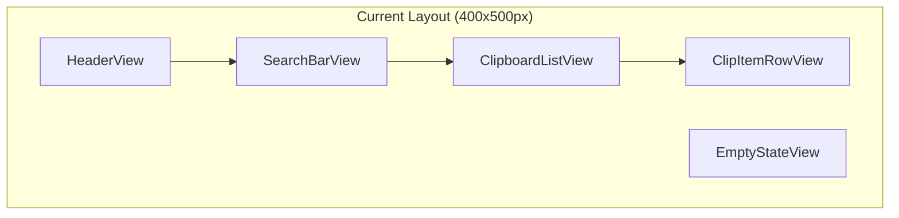
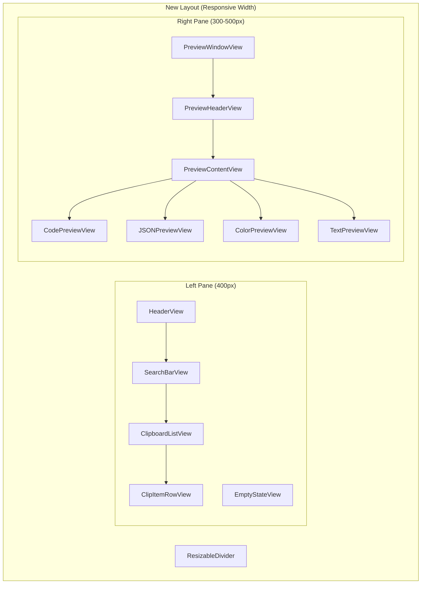

# ClipAI Preview Window Feature - Product Requirements Document

## 1. Overview

This document outlines the implementation plan for adding a preview window feature to ClipAI. The preview window will appear on the right side of the clipboard items list, providing rich previews for four essential content types: **text**, **code**, **JSON**, and **color**.

## 2. Goals

1. **Protocol-Based Architecture**: Implement a flexible preview system using Swift protocols for extensibility
2. **Essential Content Support**: Support core content types (text, code, JSON, color)
3. **Responsive Layout**: Dynamically resize the popup to accommodate the preview pane
4. **Performance**: Lazy loading and efficient rendering of preview content
5. **User Experience**: Smooth transitions and intuitive interaction patterns

## 3. Current Architecture Analysis

### 3.1 Tech Stack & Patterns
- **Framework**: SwiftUI with MVVM pattern
- **Concurrency**: Swift Concurrency (async/await, Task, @MainActor)
- **State Management**: @ObservableObject pattern with PopupViewModel
- **Storage**: Protocol-based abstraction (SQLite/JSON/InMemory)
- **System Integration**: AppKit (NSWindow, NSPasteboard)
- **Current Layout**: Fixed 400x500px popup with vertical list

### 3.2 Current UI Structure


### 3.3 Current Data Model
- **ClipItem**: `id`, `content` (String), `timestamp`
- **Content Types**: Currently text-only, but sample data shows various formats (URLs, code, emails, etc.)

## 4. New Architecture Design

### 4.1 Preview System Protocol Hierarchy

```swift
/// Base protocol for all preview providers
protocol ClipItemPreviewProvider {
    /// The content type this provider handles
    static var supportedContentType: ClipContentType { get }
    
    /// Check if this provider can handle the given content
    static func canPreview(_ content: String) -> Bool
    
    /// Create a preview view for the given content
    func createPreview(for content: String) -> AnyView
    
    /// Priority for this provider (higher = preferred)
    static var priority: Int { get }
}

/// Enhanced content type detection
enum ClipContentType: String, CaseIterable {
    case plainText = "text"
    case code = "code"
    case json = "json"
    case color = "color"
}
```

### 4.2 Preview Provider Implementations

```swift
// Core preview provider implementations:
struct CodePreviewProvider: ClipItemPreviewProvider { ... }
struct JSONPreviewProvider: ClipItemPreviewProvider { ... }
struct ColorPreviewProvider: ClipItemPreviewProvider { ... }
struct TextPreviewProvider: ClipItemPreviewProvider { ... }
```

### 4.3 Enhanced Data Model

```swift
extension ClipItem {
    /// Detected content type (computed property)
    var contentType: ClipContentType { ... }
    
    /// Get appropriate preview provider
    var previewProvider: ClipItemPreviewProvider? { ... }
    
    /// Additional metadata for rich previews
    var metadata: [String: Any] { ... }
}
```

## 5. UI Layout Changes

### 5.1 New Layout Structure



### 5.2 Responsive Design
- **Minimum Width**: 700px (400px list + 300px preview)
- **Maximum Width**: 1200px (400px list + 800px preview)
- **Default Width**: 900px (400px list + 500px preview)
- **Resizable**: User can drag divider to adjust pane sizes

## 6. Component Architecture

### 6.1 New Views Structure

```
Views/
├── PopupView.swift              (Modified - HStack layout)
├── ClipboardListView.swift      (Existing - minimal changes)
├── ClipItemRowView.swift        (Existing - minimal changes)
├── Preview/
│   ├── PreviewWindowView.swift     (New - Main preview container)
│   ├── PreviewHeaderView.swift     (New - Preview title/actions)
│   ├── PreviewContentView.swift    (New - Content router)
│   ├── Providers/
│   │   ├── CodePreviewView.swift   (New - Syntax highlighting)
│   │   ├── JSONPreviewView.swift   (New - JSON formatting)
│   │   ├── ColorPreviewView.swift  (New - Color swatches)
│   │   ├── TextPreviewView.swift   (New - Rich text formatting)
│   │   └── EmptyPreviewView.swift  (New - No selection state)
│   └── ResizableDivider.swift      (New - Pane resizing)
```

### 6.2 ViewModel Changes

```swift
// Enhanced PopupViewModel
@MainActor
class PopupViewModel: ObservableObject, ClipboardStoreDelegate {
    // ... existing properties ...
    
    // Preview-related properties
    @Published var selectedItemForPreview: ClipItem?
    @Published var previewPaneWidth: CGFloat = 500
    @Published var isPreviewVisible: Bool = true
    
    // Preview provider registry
    private let previewProviders: [ClipItemPreviewProvider.Type] = [
        CodePreviewProvider.self,
        JSONPreviewProvider.self,
        ColorPreviewProvider.self,
        TextPreviewProvider.self  // Fallback
    ]
    
    // Methods
    func getPreviewProvider(for item: ClipItem) -> ClipItemPreviewProvider? { ... }
    func togglePreviewPane() { ... }
    func updatePreviewPaneWidth(_ width: CGFloat) { ... }
}
```

## 7. Content Detection & Preview Types

### 7.1 Content Detection Logic

```swift
enum ContentDetectionRule {
    case regex(String)
    case fileExtension([String])
    case prefix(String)
    case custom((String) -> Bool)
}

struct ContentTypeDetector {
    static let rules: [ClipContentType: [ContentDetectionRule]] = [
        .code: [
            .fileExtension(["swift", "js", "py", "java", "cpp"]),
            .regex(#"^(import|class|func|def|function|var|let|const)\s"#),
            .custom(CodeDetector.isCode)
        ],
        .json: [
            .prefix("{"),
            .prefix("["),
            .custom(JSONDetector.isValidJSON)
        ],
        .color: [
            .regex(#"^#[0-9A-Fa-f]{6}$"#),
            .regex(#"^#[0-9A-Fa-f]{3}$"#),
            .regex(#"^rgb\(\d+,\s*\d+,\s*\d+\)$"#),
            .regex(#"^hsl\(\d+,\s*\d+%,\s*\d+%\)$"#)
        ]
    ]
}
```

### 7.2 Preview Implementations

#### 7.2.1 Code Preview
- **Syntax Highlighting**: Using SwiftUI Text with AttributedString
- **Language Detection**: Based on keywords and patterns  
- **Features**: Line numbers, copy button, language indicator
- **Supported Languages**: Swift, JavaScript, Python, Java, C++, and more

#### 7.2.2 JSON Preview
- **Pretty Formatting**: Proper indentation and structure
- **Syntax Highlighting**: Keys, values, strings, numbers with different colors
- **Features**: Expand/collapse objects, copy formatted JSON, validation
- **Error Handling**: Invalid JSON fallback to text preview

#### 7.2.3 Color Preview
- **Color Formats**: HEX (#RGB, #RRGGBB), RGB, HSL
- **Display**: Large color swatch with color information
- **Features**: Copy color value, format conversion, accessibility info
- **Visual**: Color name lookup, contrast ratio display

#### 7.2.4 Text Preview
- **Rich Formatting**: Better typography, line breaks, text statistics
- **Features**: Word count, character count, reading time estimate
- **Display**: Improved font rendering and spacing over list view
- **Actions**: Copy all, select all, text search within content

## 8. Implementation Phases

### Phase 1: Foundation (Week 1)
1. **Protocol Architecture**: Implement `ClipItemPreviewProvider` protocol
2. **Basic Layout**: Split PopupView into HStack with resizable panes
3. **Preview Container**: Create `PreviewWindowView` and `PreviewContentView`
4. **Text Preview**: Implement basic text preview as fallback

**Deliverables:**
- Preview protocol system
- Resizable dual-pane layout
- Basic text preview
- Updated PopupViewModel

### Phase 2: Content Detection (Week 2)
1. **Content Type System**: Implement `ClipContentType` enum and detection
2. **Detection Rules**: Create regex patterns and detection logic
3. **Provider Registry**: Implement provider selection system
4. **Enhanced ClipItem**: Add contentType computed property

**Deliverables:**
- Content type detection system
- Provider registry and selection
- Enhanced data model

### Phase 3: Preview Providers (Week 3-4)
1. **Code Preview**: Syntax highlighting and code formatting
2. **JSON Preview**: Pretty formatting and syntax highlighting
3. **Color Preview**: Color swatch and format conversion
4. **Text Preview**: Enhanced text display with statistics

**Deliverables:**
- 4 fully functional preview providers
- Rich preview experiences for each type
- Copy/action buttons for each preview type

### Phase 4: Polish & Performance (Week 5)
1. **Performance**: Lazy loading, async content processing
2. **Animations**: Smooth transitions between previews
3. **Accessibility**: VoiceOver support, keyboard navigation
4. **Preferences**: User settings for preview behavior

**Deliverables:**
- Performance optimizations
- Accessibility compliance
- User preferences system

## 9. Technical Considerations

### 9.1 Performance
- **Lazy Loading**: Only generate previews for visible/selected items
- **Caching**: Cache preview providers and rendered content
- **Async Processing**: Use async/await for heavy preview generation
- **Memory Management**: Weak references and proper cleanup

### 9.2 Error Handling
- **Graceful Degradation**: Fall back to text preview on errors
- **User Feedback**: Show loading states and error messages
- **Logging**: Comprehensive error logging for debugging

### 9.3 Testing Strategy
- **Unit Tests**: Preview provider logic and content detection
- **UI Tests**: Preview pane interactions and layout
- **Performance Tests**: Memory usage and rendering performance
- **Edge Cases**: Malformed content, extremely large content

## 10. User Experience Design

### 10.1 Interaction Patterns
- **Selection**: Click item to show preview, keyboard navigation updates preview
- **Resizing**: Drag divider to adjust pane sizes, remember user preference
- **Actions**: Preview-specific actions (copy color, open URL, etc.)
- **Collapsing**: Toggle preview pane visibility with keyboard shortcut

### 10.2 Visual Design
- **Consistency**: Match existing ClipAI design language
- **Typography**: Clear hierarchy and readable fonts
- **Colors**: Accent colors for highlights and actions
- **Spacing**: Proper margins and padding for content

### 10.3 Accessibility
- **VoiceOver**: Proper labels and descriptions
- **Keyboard Navigation**: Full keyboard access to all features
- **High Contrast**: Support for high contrast mode
- **Zoom**: Proper behavior with system zoom levels

## 11. Future Enhancements

### 11.1 Advanced Features
- **Plugin System**: Allow third-party preview providers
- **Custom Actions**: User-defined actions for content types
- **Preview Themes**: Multiple color schemes and layouts
- **Export Options**: Save previews as images or files

### 11.2 Content Type Extensions
- **URL Preview**: Link information and favicon display
- **Image Preview**: Base64 and URL image display  
- **Email Preview**: Email formatting and contact info
- **Data Formats**: CSV, XML, YAML previews

### 11.3 Integration Features
- **Quick Actions**: System-wide content actions
- **Share Extensions**: Share preview content to other apps
- **Spotlight**: Index preview content for search
- **CloudKit**: Sync preview preferences across devices

## 12. Success Metrics

### 12.1 Technical Metrics
- **Performance**: Preview generation < 100ms
- **Memory**: < 50MB additional memory usage
- **Startup**: No impact on app launch time
- **Battery**: Minimal battery impact

### 12.2 User Experience Metrics
- **Adoption**: % of users who enable preview pane
- **Engagement**: Time spent viewing previews
- **Actions**: Usage of preview-specific actions
- **Feedback**: User satisfaction scores

## 13. Focused Implementation Scope

### 13.1 Core Preview Types (Phase 1 Implementation)
1. **Text Preview**: Enhanced text display with statistics and better typography
2. **Code Preview**: Syntax highlighting for popular languages (Swift, JS, Python, etc.)
3. **JSON Preview**: Pretty formatting with collapsible objects and syntax highlighting
4. **Color Preview**: Color swatches with format conversion and accessibility info

### 13.2 Immediate Next Steps
1. Create the protocol architecture (`ClipItemPreviewProvider`)
2. Implement content type detection for the four types
3. Build the basic dual-pane layout with resizable divider
4. Implement the four preview providers
5. Add smooth transitions and keyboard navigation

## 14. Conclusion

The preview window feature will significantly enhance ClipAI's value proposition by providing rich, contextual previews of clipboard content. By focusing on the four most essential content types (text, code, JSON, color), we can deliver immediate value while maintaining a clean, extensible architecture for future enhancements.

The protocol-based design ensures that additional content types can be easily added later without disrupting the core functionality.