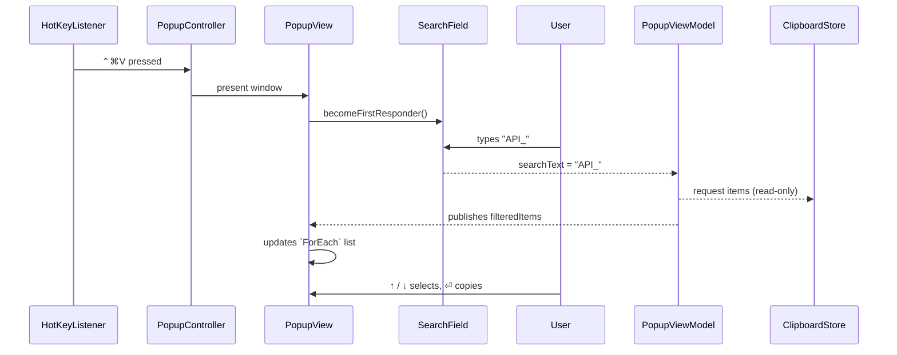

# Search Bar in Clipboard Popup – Product & Technical Design

_Last updated: 2025-07-31_

---

## 1. Purpose
The Popup currently lists up to **100** clipboard items in reverse-chronological order. Power users often need to retrieve a specific older snippet quickly.  A **search bar** at the top of the popup will allow incremental text filtering so that users can locate entries instantaneously without scrolling.

## 2. User Stories
1. **Locate by keyword** – *“As a user, I want to type part of the text I previously copied so that the list shows only matching items.”*
2. **Instant focus** – *“When the popup opens, the cursor should already be inside the search field so I can start typing immediately.”*
3. **Keyboard friendly** – *“Arrow-key navigation & ⏎ copy should still work on the filtered list.”*
4. **Clear & reset** – *“Pressing ⎋ clears the search field and restores the full list. Pressing ⎋ again closes the popup (current behaviour).”*

## 3. UX Specification
```
┌──────────────────────────────────────────┐
│ 🔍  Search clipboard…                    │  <-- Auto-focused NSSearchField
├──────────────────────────────────────────┤
│  🚀 "Launch spec for v1…"                │
│  🔑 API_KEY=abc123                       │  <-- Filtered `ClipItemRowView`s
│  …                                       │
└──────────────────────────────────────────┘
```
• The search field replaces the current multi-line header in `PopupView` (counter & subtitle are now secondary).  
• Matches are **case-insensitive** and executed on the `content` string of each `ClipItem`.  
• Empty search string shows the unfiltered list.

### Colour / Theming
Use system `accentColor` for the search icon.  Field inherits material background so visual style remains consistent with popup.

## 4. Interaction Flow


## 5. Component Changes & Re-use
| Layer | Addition / Change | Notes |
|-------|-------------------|-------|
| **View** | `SearchBarView.swift` *(new)* | Wraps `NSSearchField` with `SwiftUI.NSSearchFieldRepresentable` to gain auto-focus on appear.  Added above existing `ScrollView`. |
| | `PopupView.swift` | Adds `@State var searchText: String` and embeds `SearchBarView`. Removes old subtitle label. Passes `searchText` down via `viewModel`. |
| **ViewModel** | `PopupViewModel` | Adds `@Published var searchText` and computed `var filteredItems: [ClipItem]`. Logic: if `searchText.isEmpty` return store.items else `store.items.filter { $0.content.localizedCaseInsensitiveContains(searchText) }`. |
| **Model** | *No change* | Filtering is purely in VM – store remains full source-of-truth. |

## 6. Behavioural Details
1. **Performance** – Filtering 100 strings is trivial; runs on main thread.  For future scaling we can debounce updates (e.g. 50 ms) but not required now.
2. **Focus Management** – Use `@FocusState` on `SearchBarView`. `onAppear` sets it true; when user presses ⎋ and searchText != "" we clear & keep focus; if searchText == "" we close popup (delegate to existing escape handler).
3. **Accessibility** – Field is announced as “Search clipboard history”.  Keyboard shortcuts unchanged.

## 7. Engineering Tasks
| # | Task | Owner | Estimate |
|---|------|-------|----------|
| 1 | Create `SearchBarView` bridging `NSSearchField` | iOS/macOS dev | 1 h |
| 2 | Add state & published props to `PopupViewModel` | | 30 m |
| 3 | Integrate search bar into `PopupView` layout | | 1 h |
| 4 | Update keyboard navigation to use `filteredItems` | | 30 m |
| 5 | Unit tests: filtering logic, escape behaviour | | 1 h |
| 6 | UI tests: open popup, type, verify rows reduced | | 1 h |
| 7 | Update docs & screenshots | | 30 m |

_Total ~5 h._

## 8. Acceptance Criteria
- [ ] Popup auto-focuses search field on every open.
- [ ] Typing filters list in real time (≤30 ms perceptible delay).
- [ ] Arrow navigation & copy works identically on filtered list.
- [ ] Clearing search shows full list again.
- [ ] All existing unit/UI tests pass; new tests added.

## 9. Risks & Mitigations
| Risk | Impact | Mitigation |
|------|--------|------------|
| `NSSearchField` focus lost when window re-opens | Medium | Integration test loop; fallback to manual `.becomeFirstResponder()` if `.focused` fails |
| Escape key intercept conflicts with existing close logic | Low | Implement two-stage escape as specified |
| Duplicate state (searchText in both View & VM) | Low | Single-source in VM; View binds via `@ObservedObject` |

## 10. Out-of-Scope / Future Enhancements
1. **Regex or fuzzy search** for more powerful matching.  
2. **Search history** suggestions.  
3. **Highlight matched substrings** within results.

---
